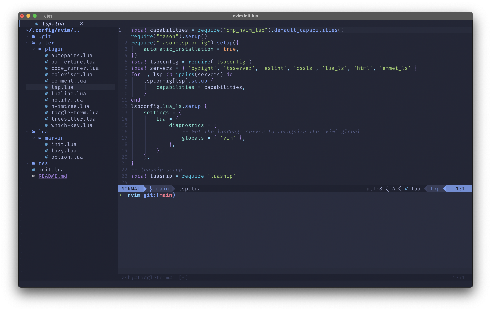

# NeoChad: Neovim Config for Linux Enthusiasts

<p align="center">
  
</p>

## 🚀 About NeoChad

NeoChad is a sleek and powerful Neovim configuration designed for Linux enthusiasts. Whether you're a coding ninja or a terminal wizard, NeoChad aims to provide a smooth, efficient, and delightful experience for your text editing needs.

> **⚠️ Note:** This configuration is currently in **beta**. Expect updates and improvements as we continue to enhance it.

---

## 🔧 Installation Instructions

Follow these steps to get started with NeoChad:

### 1. Clone the Repository

Run the following command in your terminal to clone the NeoChad configuration:

```bash
git clone https://github.com/SOHAN-MONIES/NeoChad ~/.config/nvim
```

---

## 💡 Features

- Minimalistic and optimized configuration
- Pre-configured plugins for an enhanced workflow
- Tailored for Linux power users and developers
- Stunning visuals with customization options

---

## 🔧 Requirements

- **Neovim** (v0.7.0 or newer)
- A **Linux-based system**
- Git installed on your system

---

## 🔧 Future Plans

NeoChad is a work in progress. Planned features include:

- Enhanced plugin integration
- Multi-platform support
- Detailed documentation for customization

---

## 🖼️ Preview

<p align="center">
  
</p>

---

Stay tuned for updates and contribute to make NeoChad even better!
